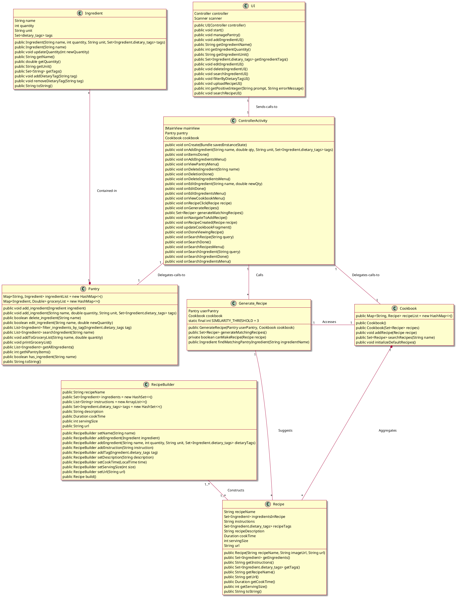

# Model — Controller Diagram:

```plantuml
@startuml

skin rose

hide empty methods
' classes

class Ingredient{
    String name
    int quantity
    String unit
    Set<dietary_tags> tags
    __
    public Ingredient(String name, int quantity, String unit, Set<Ingredient.dietary_tags> tags)
    public Ingredient(String name)
    public void updateQuantity(int newQuantity)
    public String getName()
    public double getQuantity()
    public String getUnit()
    public Set<String> getTags()
    public void addDietaryTag(String tag)
    public void removeDietaryTag(String tag)
    public String toString()
}

class Pantry{
    Map<String, Ingredient> ingredientList = new HashMap<>()
    Map<Ingredient, Double> groceryList = new HashMap<>()
    --
    public void add_ingredient(Ingredient ingredient)
    public void add_ingredient(String name, double quantity, String unit, Set<Ingredient.dietary_tags> tags)
    public boolean delete_ingredient(String name)
    public boolean edit_ingredient(String name, double newQuantity)
    public List<Ingredient> filter_ingredients_by_tag(Ingredient.dietary_tags tag)
    public List<Ingredient> searchIngredient(String name)
    public void addToGroceryList(String name, double quantity)
    public void printGroceryList()
    public List<Ingredient> getAllIngredients()
    public int getNPantryItems()
    public boolean has_ingredient(String name)
    public String toString()
}

class Recipe{
    String recipeName
    Set<Ingredient> ingredientsInRecipe
    String instructions
    Set<Ingredient.dietary_tags> recipeTags
    String recipeDescription
    Duration cookTime
    int servingSize
    String url
    --
    public Recipe(String recipeName, String imageUrl, String url)
    public Set<Ingredient> getIngredients()
    public String getInstructions()
    public Set<Ingredient.dietary_tags> getTags()
    public String getRecipeName()
    public String getUrl()
    public Duration getCookTime()
    public int getServingSize()
    public String toString()
}

class RecipeBuilder{
    public String recipeName
    public Set<Ingredient> ingredients = new HashSet<>()
    public List<String> instructions = new ArrayList<>()
    public Set<Ingredient.dietary_tags> tags = new HashSet<>()
    public String description
    public Duration cookTime
    public int servingSize
    public String url
    --
    public RecipeBuilder setName(String name)
    public RecipeBuilder addIngredient(Ingredient ingredient)
    public RecipeBuilder addIngredient(String name, int quantity, String unit, Set<Ingredient.dietary_tags> dietaryTags)
    public RecipeBuilder addInstruction(String instruction)
    public RecipeBuilder addTag(Ingredient.dietary_tags tag)
    public RecipeBuilder setDescription(String description)
    public RecipeBuilder setCookTime(LocalTime time)
    public RecipeBuilder setServingSize(int size)
    public RecipeBuilder setUrl(String url)
    public Recipe build()
}

class Generate_Recipe{
    Pantry userPantry
    Cookbook cookbook
    static final int SIMILARITY_THRESHOLD = 3    
    --
    public GenerateRecipe(Pantry userPantry, Cookbook cookbook)
    public Set<Recipe> generateMatchingRecipes()
    private boolean canMakeRecipe(Recipe recipe)
    public Ingredient findMatchingPantryIngredient(String ingredientName)
    
}

class UI {
    Controller controller
    Scanner scanner
    --
    public UI(Controller controller)
    public void start()
    public void managePantry()
    public void addIngredientUI()
    public String getIngredientName()
    public int getIngredientQuantity()
    public String getIngredientUnit()
    public Set<Ingredient.dietary_tags> getIngredientTags()
    public void editIngredientUI()
    public void deleteIngredientUI()
    public void searchIngredientUI()
    public void filterByDietaryTagUI()
    public void uploadRecipeUI()
    public int getPositiveInteger(String prompt, String errorMessage)
    public void searchRecipeUI()
}

class ControllerActivity {
    IMainView mainView
    Pantry pantry
    Cookbook cookbook
    --
    public void onCreate(Bundle savedInstanceState)
    public void onAddIngredient(String name, double qty, String unit, Set<Ingredient.dietary_tags> tags)
    public void onItemsDone()
    public void onAddIngredientsMenu()
    public void onViewPantryMenu()
    public void onDeleteIngredient(String name)
    public void onDeletionDone()
    public void onDeleteIngredientsMenu()
    public void onEditIngredient(String name, double newQty)
    public void onEditDone()
    public void onEditIngredientsMenu()
    public void onViewCookbookMenu()
    public void onRecipeClick(Recipe recipe)
    public void onGenerateRecipes()
    public Set<Recipe> generateMatchingRecipes()
    public void onNavigateToAddRecipe()
    public void onRecipeCreated(Recipe recipe)
    public void updateCookbookFragment()
    public void onDoneViewingRecipe()
    public void onSearchRecipe(String query)
    public void onSearchDone()
    public void onSearchRecipesMenu()
    public void onSearchIngredient(String query)
    public void onSearchIngredientDone()
    public void onSearchIngredientsMenu()
}

class Cookbook {
    public Map<String, Recipe> recipeList = new HashMap<>()
    --
    public Cookbook()
    public Cookbook(Set<Recipe> recipes)
    public void addRecipe(Recipe recipe)
    public Set<Recipe> searchRecipes(String name)
    public void initializeDefaultRecipes()
}

    
    
' associations
UI "1" -down- "1" ControllerActivity : \tSends-calls-to\t\t

ControllerActivity "1" -right- "*" Generate_Recipe : \tCalls\t\t
ControllerActivity "1" -down- "1" Pantry : \tDelegates-calls-to\t\t
ControllerActivity "1" -down- "1" Cookbook : \tDelegates-calls-to\t\t

Pantry "1" *--up- "*" Ingredient : \tContained-in\t\t
RecipeBuilder "1..*" -down- "1..*" Recipe : \tConstructs\t\t
Generate_Recipe "1" -down "*" Recipe : \tSuggests\t\t
Generate_Recipe "1" -down "1" Cookbook : \tAccesses\t\t


Cookbook "1" *--down- "*" Recipe : \tAggregates\t\t

@enduml


```

# View (Fragments and Interfaces) Diagram:

```plantuml
@startuml

skin rose

hide empty methods
' classes

class AddIngredientFragment {
    FragmentAddItemsBinding binding
    Listener listener
    List<Ingredient> addedIngredients = new ArrayList<>()
    IngredientAdapter ingredientAdapter
    --
    public static AddIngredientFragment newInstance(Listener listener)
    public View onCreateView(@NonNull LayoutInflater inflater, ViewGroup container, Bundle savedInstanceState)
    public void onViewCreated(@NonNull View view, @Nullable Bundle savedInstanceState)
    public void onAddButtonClicked()
    public void setupQuantityField()
    public void clearInputs()
    public void onDoneButtonClicked()
    public void showDoneMessage()   
}

interface IAddIngredientView {
    interface Listener {
        void onAddIngredient(String name, double qty, String unit, Set<Ingredient.dietary_tags> tags)
        void onItemsDone()
}

class AddRecipeFragment {
    FragmentAddRecipeBinding binding
    Listener listener
    RecipeBuilder recipeBuilder = new RecipeBuilder()
    --
    public static AddRecipeFragment newInstance(Listener listener)
    public View onCreateView(@NonNull LayoutInflater inflater, ViewGroup container, Bundle savedInstanceState)
    public void onViewCreated(@NonNull View view, @Nullable Bundle savedInstanceState)
    public void onAddIngredientButtonClicked()
    public void onAddInstructionButtonClicked()
    public void onDoneButtonClicked()
    public void clearIngredientFields()
    public void clearInstructionField()
    public void onSaveRecipe()
    public void setupInputFields()
}

interface IAddRecipeView {
    interface Listener {
        void onRecipeCreated(Recipe recipe)
}

class CookbookFragment {
    FragmentCookbookBinding binding
    RecyclerView recyclerView
    RecipeAdapter recipeAdapter
    Cookbook cookbook
    Listener listener
    --
    public static CookbookFragment newInstance(ICookbookView.Listener listener, Cookbook cookbook)
    public View onCreateView(@NonNull LayoutInflater inflater, ViewGroup container, Bundle savedInstanceState)
    public void onViewCreated(View view, Bundle savedInstanceState)
    public void onRecipeCreated(Recipe recipe)
    public void onSearchRecipesMenu()
    public void onRecipeClick(Recipe recipe)
    public void navigateToAddRecipe()
    public void onCookbookRecipesLoaded(Cookbook cookbook)
    public void setupRecyclerView()
}

interface ICookbookView {
    interface Listener {
        void onViewCookbookMenu()
        void onRecipeClick(Recipe recipe)
        void onNavigateToAddRecipe()
        void onSearchRecipesMenu()
        void onRecipeCreated(Recipe recipe)
        void onCookbookRecipesLoaded(Cookbook cookbook)
}

class DeleteIngredientFragment {
    FragmentDeleteItemsBinding binding
    IDeleteIngredientView.Listener listener
    --
    public static DeleteIngredientFragment newInstance(IDeleteIngredientView.Listener listener)
    public View onCreateView(@NonNull LayoutInflater inflater, @Nullable ViewGroup container,
                             @Nullable Bundle savedInstanceState)
    public void onViewCreated(@NonNull View view, @Nullable Bundle savedInstanceState)
    public void onDeleteButtonClicked()
    public void updatePantryDisplay(@NonNull final Pantry pantry)
    public void clearInputs()
    public void onDoneButtonClicked()
    public void showIngredientDeletedMessage(String name)
    public void showIngredientNotFoundError(String name)                         
}

interface IDeleteIngredientView {
    interface Listener {
        void onDeleteIngredient(String name)
        void onDeletionDone()
}

class PantryFragment {
    FragmentPantryBinding binding
    Listener listener
    Pantry pantry
    --
    public static PantryFragment newInstance(IPantryView.Listener listener, Pantry pantry)
    public View onCreateView(@NonNull LayoutInflater inflater, ViewGroup container, Bundle savedInstanceState)
    public void onViewCreated(@NonNull View view, @Nullable Bundle savedInstanceState)
    public void onAddIngredientButtonClicked()
    public void onViewPantryMenu()
    public void onDeleteButtonClicked()
    public void onEditButtonClicked()
    public void onSearchIngredientsMenu()
}

interface IPantryView {
    interface Listener {
        void onAddIngredientsMenu()
        void onDeleteIngredientsMenu()
        void onViewPantryMenu()
        void onEditIngredientsMenu()
        void onViewCookbookMenu()
        void onGenerateRecipes()
        void onSearchIngredientsMenu()
}

class RecipeDetailFragment {
    static final String ARG_RECIPE = "recipe"
    Recipe recipe
    Listener listener
    --
    public static RecipeDetailFragment newInstance(Recipe recipe)
    public void onAttach(@NonNull Context context)
    public void onCreate(@Nullable Bundle savedInstanceState)
    public View onCreateView(@NonNull LayoutInflater inflater, ViewGroup container, Bundle savedInstanceState)
    public String formatCookTime(Duration cookTime)
}

interface IRecipeDetailView {
    interface Listener {
        void onDoneViewingRecipe()
}

class RecipeFragment {
    private static final String ARG_COOKBOOK = "cookbook"
    Cookbook cookbook
    RecyclerView recyclerView
    RecipeAdapter recipeAdapter
    --
    public static RecipeFragment newInstance(Cookbook cookbook)
    public void onCreate(@Nullable Bundle savedInstanceState)
    public View onCreateView(@NonNull LayoutInflater inflater, @Nullable ViewGroup container, @Nullable Bundle savedInstanceState)
    public void updateCookbook(Cookbook newCookbook)
    public void showNoRecipesMessage()
    private void onRecipeSelected(Recipe recipe)
}

class SearchIngredientFragment {
    FragmentSearchIngredientBinding binding
    Listener listener
    --
    public static SearchIngredientFragment newInstance(Listener listener)
    public View onCreateView(@NonNull LayoutInflater inflater, ViewGroup container, Bundle savedInstanceState)
    public void onViewCreated(@NonNull View view, @Nullable Bundle savedInstanceState)
    public void onSearchButtonClicked()
    public void onDoneButtonClicked()
    public void showIngredientNotFoundError()
    public void displayFoundIngredients(List<Ingredient> ingredients) 
}

interface ISearchIngredientView {
    interface Listener {
        void onSearchIngredient(String query)
        void onSearchIngredientDone()
}

class SearchRecipeFragment {
    FragmentSearchRecipeBinding binding
    Listener listener
    --
    public static SearchRecipeFragment newInstance(Listener listener)
    public View onCreateView(@NonNull LayoutInflater inflater, ViewGroup container, Bundle savedInstanceState)
    public void onViewCreated(@NonNull View view, @Nullable Bundle savedInstanceState)
    public void onSearchButtonClicked()
    public void onDoneButtonClicked()
    public void showRecipeNotFoundError()
}

interface ISearchRecipeView {
    interface Listener {
        void onSearchRecipe(String query)
        void onSearchDone()
}

class MainView {
    MainBinding binding
    FragmentManager fmanager
    Context context
    IPantryView.Listener listener
    --
    public MainView(final Context context,  IPantryView.Listener listener)
    public void setListener(IPantryView.Listener listener)
    public View getRootView()
    public void displayFragment(@NonNull Fragment fragment)
    public void displayFragment(@NonNull final Fragment fragment, final String transName)
}

interface IMainView {
    View getRootView();
    void displayFragment(@NonNull final Fragment fragment)
    void setListener(IPantryView.Listener listener)
}


' associations
AddIngredientFragment "1" -down- "1" IAddIngredientView : \tImplements\t\t
AddRecipeFragment "1" -down- "1" IAddRecipeView : \tImplements\t\t
CookbookFragment "1" -up- "1" ICookbookView : \tIs-implemented-by\t\t
CookbookFragment "1" -up- "1" RecipeFragment : \tIs-gathered-in\t\t
DeleteIngredientFragment "1" -down- "1" IDeleteIngredientView : \tImplements\t\t
PantryFragment "1" -down- "1" IPantryView : \tImplements\t\t
RecipeDetailFragment "1" -up- "1" IRecipeDetailView : \tIs-implemented-by\t\t
RecipeDetailFragment "1" -up- "1" RecipeFragment : \tIs-displayed-by\t\t
SearchIngredientFragment "1" -up- "1" ISearchIngredientView : \tIs-implemented-by\t\t
SearchRecipeFragment "1" -down- "1" ISearchRecipeView : \tImplements\t\t
MainView "1" -down- "1" IMainView : \tImplements\t\t
MainView "1" -down- "1" IPantryView : \tImplements\t\t
MainView "1" -down- "1" PantryFragment : \tDisplays\t\t
MainView "1" -left- "1" AddRecipeFragment : \tDisplays\t\t
MainView "1" -up- "1" CookbookFragment : \tDisplays\t\t
MainView "1" -right- "1" AddIngredientFragment : \tDisplays\t\t
MainView "1" -up- "1" DeleteIngredientFragment : \tDisplays\t\t
MainView "1" -up- "1" SearchRecipeFragment : \tDisplays\t\t
MainView "1" -down- "1" SearchIngredientFragment : \tDisplays\t\t


@enduml
```