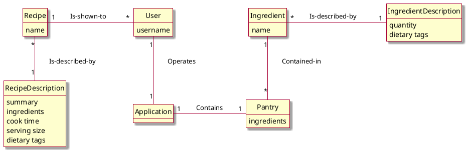
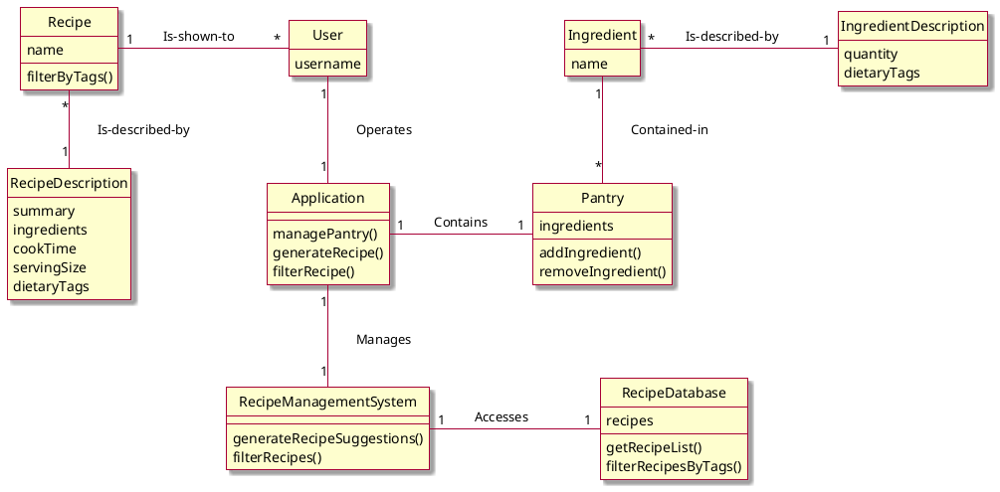
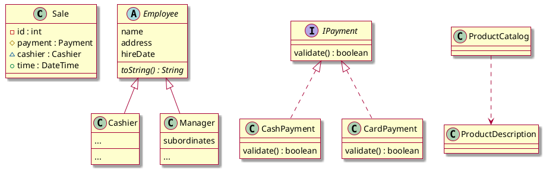

```plantuml
@startuml

skin rose

hide circle
hide empty methods
' classes

class Pantry{
 ingredients
}

class Recipe{
 name
}

class RecipeDescription{
 summary
 ingredients
 cook time
 serving size
 dietary tags
}

class Ingredient{
 name
}

class IngredientDescription{
 quantity
 dietary tags
}

class Application{

}

class User{
 username
}


' associations
User "1" -down- "1" Application : \tOperates\t\t
Application "1" -right- "1" Pantry : \tContains\t\t
Pantry "*" -up- "1" Ingredient : \tContained-in\t\t
Recipe "*" -down- "1" RecipeDescription : \tIs-described-by\t\t
Ingredient "*" -right- "1" IngredientDescription : \tIs-described-by\t\t
User "*" -left- "1" Recipe : \tIs-shown-to\t\t


@enduml
```

```plantuml
@startuml

skin rose

hide circle
hide empty methods

class User {
username
}

class Application {
managePantry()
generateRecipe()
filterRecipe()
}

class Pantry {
ingredients
addIngredient()
removeIngredient()
}

class Ingredient {
name
}

class IngredientDescription {
quantity
dietaryTags
}

class Recipe {
name
filterByTags()
}

class RecipeDescription {
summary
ingredients
cookTime
servingSize
dietaryTags
}

class RecipeDatabase {
recipes
getRecipeList()
filterRecipesByTags()
}

class RecipeManagementSystem {
generateRecipeSuggestions()
filterRecipes()
}

' Associations
User "1" -down- "1" Application : \tOperates\t\t
Application "1" -right- "1" Pantry : \tContains\t\t
Pantry "*" -up- "1" Ingredient : \tContained-in\t\t
Ingredient "*" -right- "1" IngredientDescription : \tIs-described-by\t\t
User "*" -left- "1" Recipe : \tIs-shown-to\t\t
Recipe "*" -down- "1" RecipeDescription : \tIs-described-by\t\t
Application "1" -down- "1" RecipeManagementSystem : \tManages\t\t
RecipeManagementSystem "1" -right- "1" RecipeDatabase : \tAccesses\t\t

@enduml
```

NOTES FROM SLIDES:

```plantuml
@startuml

skin rose
'skinparam classAttributeIconSize 0

'NOTES:'
class Sale{
-id : int
#payment : Payment
~cashier : Cashier
+time : DateTime
}


class Cashier{
...
--
...
}
class Manager{
subordinates
--
...
}
Employee <|-- Cashier
Employee <|-- Manager

abstract class Employee{
 name
 address
 hireDate
 --
 {abstract} toString() : String
}

interface IPayment {
 validate() : boolean
}
class CashPayment{
 validate() : boolean
}
class CardPayment{
 validate() : boolean
}
IPayment <|.. CashPayment
IPayment <|.. CardPayment

'Dependencies'
ProductCatalog ..> ProductDescription

@enduml
```
