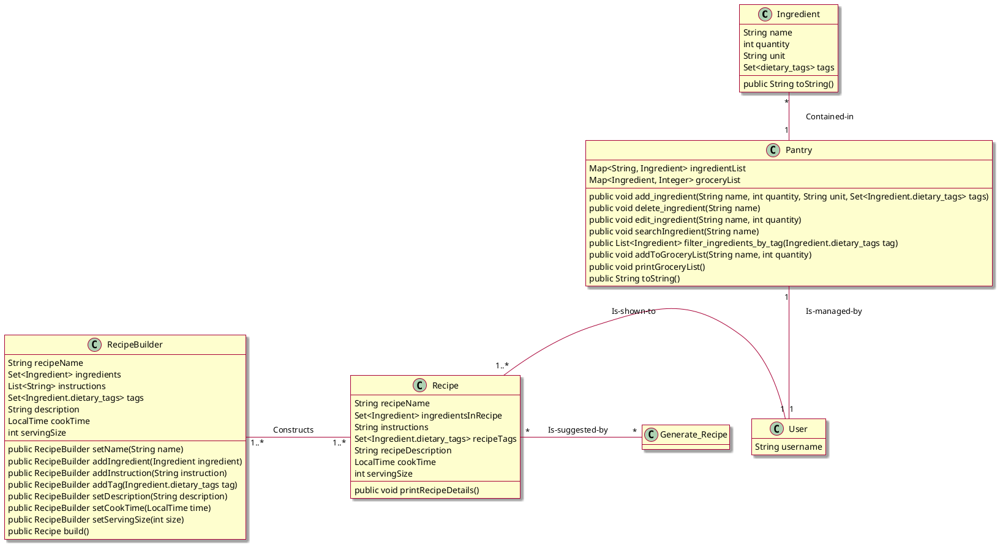

```plantuml
@startuml

skin rose

hide empty methods
' classes

class Ingredient{
 String name
 int quantity
 String unit
 Set<dietary_tags> tags
 __
 public String toString()
}

class Pantry{
 Map<String, Ingredient> ingredientList
 Map<Ingredient, Integer> groceryList
 --
 public void add_ingredient(String name, int quantity, String unit, Set<Ingredient.dietary_tags> tags)
 public void delete_ingredient(String name)
 public void edit_ingredient(String name, int quantity)
 public void searchIngredient(String name)
 public List<Ingredient> filter_ingredients_by_tag(Ingredient.dietary_tags tag)
 public void addToGroceryList(String name, int quantity)
 public void printGroceryList()
 public String toString()
}

class Recipe{
 String recipeName
 Set<Ingredient> ingredientsInRecipe
 String instructions
 Set<Ingredient.dietary_tags> recipeTags
 String recipeDescription
 LocalTime cookTime
 int servingSize
 --
 public void printRecipeDetails()
}

class RecipeBuilder{
 String recipeName
 Set<Ingredient> ingredients
 List<String> instructions
 Set<Ingredient.dietary_tags> tags
 String description
 LocalTime cookTime
 int servingSize
 --
 public RecipeBuilder setName(String name)
 public RecipeBuilder addIngredient(Ingredient ingredient)
 public RecipeBuilder addInstruction(String instruction)
 public RecipeBuilder addTag(Ingredient.dietary_tags tag)
 public RecipeBuilder setDescription(String description)
 public RecipeBuilder setCookTime(LocalTime time)
 public RecipeBuilder setServingSize(int size)
 public Recipe build()
}


class User{
 String username
}

class Generate_Recipe{

}

' associations
User "1" -up- "1" Pantry : \tIs-managed-by\t\t
Pantry "1" -up- "*" Ingredient : \tContained-in\t\t
User "1" -left- "1..*" Recipe : \tIs-shown-to\t\t
Recipe "1..*" -up "1..*" RecipeBuilder : \tConstructs\t\t
Generate_Recipe "*" -left "*" Recipe : \tIs-suggested-by\t\t

@enduml

```