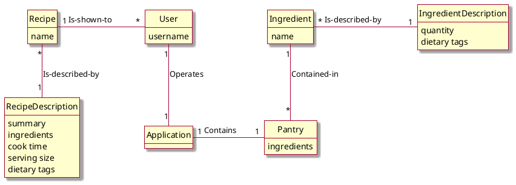

```plantuml
@startuml

skin rose

hide circle
hide empty methods
' classes

class Pantry{
 ingredients
}

class Recipe{
 name
}

class RecipeDescription{
 summary
 ingredients
 cook time
 serving size
 dietary tags
}

class Ingredient{
 name
}

class IngredientDescription{
 quantity
 dietary tags
}

class Application{

}

class User{
 username
}


' associations
User "1" -down- "1" Application : Operates\t\t
Application "1" -right- "1" Pantry : Contains\t\t
Pantry "*" -up- "1" Ingredient : Contained-in\t\t
Recipe "*" -down- "1" RecipeDescription : Is-described-by\t\t
Ingredient "*" -right- "1" IngredientDescription : Is-described-by\t\t
User "*" -left- "1" Recipe : Is-shown-to\t\t


@enduml
```