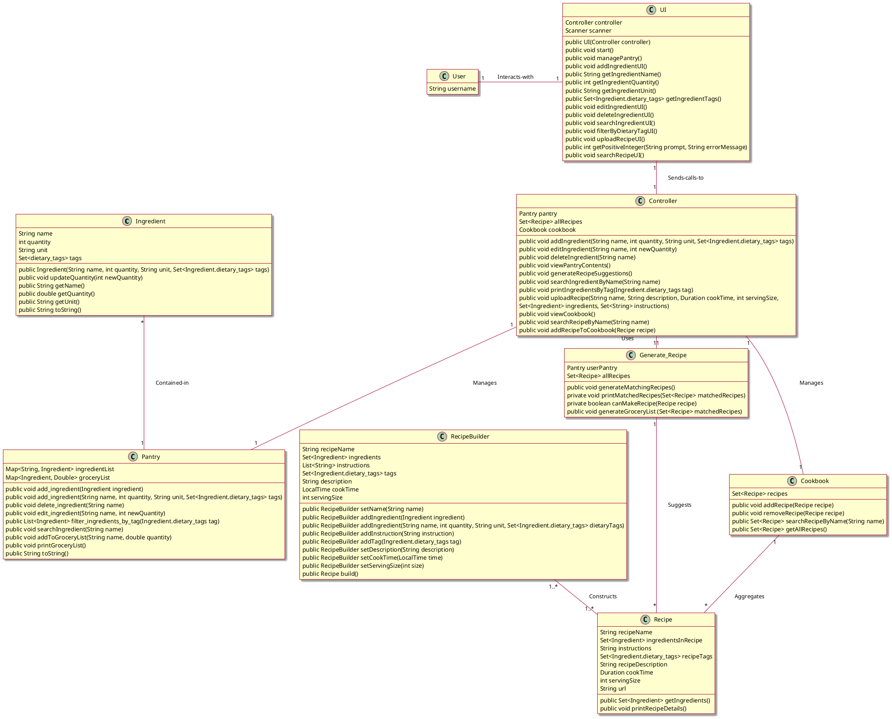

```plantuml
@startuml

skin rose

hide empty methods
' classes

class Ingredient{
    String name
    int quantity
    String unit
    Set<dietary_tags> tags
    __
    public Ingredient(String name, int quantity, String unit, Set<Ingredient.dietary_tags> tags)
    public void updateQuantity(int newQuantity)
    public String getName()
    public double getQuantity()
    public String getUnit()
    public String toString()
}

class Pantry{
    Map<String, Ingredient> ingredientList
    Map<Ingredient, Double> groceryList
    --
    public void add_ingredient(Ingredient ingredient)
    public void add_ingredient(String name, int quantity, String unit, Set<Ingredient.dietary_tags> tags)
    public void delete_ingredient(String name)
    public void edit_ingredient(String name, int newQuantity)
    public List<Ingredient> filter_ingredients_by_tag(Ingredient.dietary_tags tag)
    public void searchIngredient(String name)
    public void addToGroceryList(String name, double quantity)
    public void printGroceryList()
    public String toString()
}

class Recipe{
    String recipeName
    Set<Ingredient> ingredientsInRecipe
    String instructions
    Set<Ingredient.dietary_tags> recipeTags
    String recipeDescription
    Duration cookTime
    int servingSize
    String url
    --
    public Set<Ingredient> getIngredients()
    public void printRecipeDetails()
}

class RecipeBuilder{
    String recipeName
    Set<Ingredient> ingredients
    List<String> instructions
    Set<Ingredient.dietary_tags> tags
    String description
    LocalTime cookTime
    int servingSize
    --
    public RecipeBuilder setName(String name)
    public RecipeBuilder addIngredient(Ingredient ingredient)
    public RecipeBuilder addIngredient(String name, int quantity, String unit, Set<Ingredient.dietary_tags> dietaryTags)
    public RecipeBuilder addInstruction(String instruction)
    public RecipeBuilder addTag(Ingredient.dietary_tags tag)
    public RecipeBuilder setDescription(String description)
    public RecipeBuilder setCookTime(LocalTime time)
    public RecipeBuilder setServingSize(int size)
    public Recipe build()
}

class User{
    String username
}

class Generate_Recipe{
    Pantry userPantry
    Set<Recipe> allRecipes
    --
    public void generateMatchingRecipes()
    private void printMatchedRecipes(Set<Recipe> matchedRecipes)
    private boolean canMakeRecipe(Recipe recipe)
    public void generateGroceryList (Set<Recipe> matchedRecipes)
}

class UI {
    Controller controller
    Scanner scanner
    --
    public UI(Controller controller)
    public void start()
    public void managePantry()
    public void addIngredientUI()
    public String getIngredientName()
    public int getIngredientQuantity()
    public String getIngredientUnit()
    public Set<Ingredient.dietary_tags> getIngredientTags()
    public void editIngredientUI()
    public void deleteIngredientUI()
    public void searchIngredientUI()
    public void filterByDietaryTagUI()
    public void uploadRecipeUI()
    public int getPositiveInteger(String prompt, String errorMessage)
    public void searchRecipeUI()
}

class Controller {
    Pantry pantry
    Set<Recipe> allRecipes
    Cookbook cookbook
    --
    public void addIngredient(String name, int quantity, String unit, Set<Ingredient.dietary_tags> tags)
    public void editIngredient(String name, int newQuantity)
    public void deleteIngredient(String name)
    public void viewPantryContents()
    public void generateRecipeSuggestions()
    public void searchIngredientByName(String name)
    public void printIngredientsByTag(Ingredient.dietary_tags tag)
    public void uploadRecipe(String name, String description, Duration cookTime, int servingSize,
                              Set<Ingredient> ingredients, Set<String> instructions)
    public void viewCookbook()
    public void searchRecipeByName(String name)
    public void addRecipeToCookbook(Recipe recipe)
}

class Cookbook {
    Set<Recipe> recipes
    --
    public void addRecipe(Recipe recipe)
    public void removeRecipe(Recipe recipe)
    public Set<Recipe> searchRecipeByName(String name)
    public Set<Recipe> getAllRecipes()
}

' associations
User "1" -right- "1" UI : \tInteracts-with\t\t
UI "1" -down- "1" Controller : \tSends-calls-to\t\t

Controller "1" -right- "1" Generate_Recipe : \tUses\t\t
Controller "1" -down- "1" Pantry : \tManages\t\t
Controller "1" -down- "1" Cookbook : \tManages\t\t

Pantry "1" -up- "*" Ingredient : \tContained-in\t\t
RecipeBuilder "1..*" -down- "1..*" Recipe : \tConstructs\t\t
Generate_Recipe "1" -down "*" Recipe : \tSuggests\t\t

Cookbook "1" -down- "*" Recipe : \tAggregates\t\t

@enduml


```