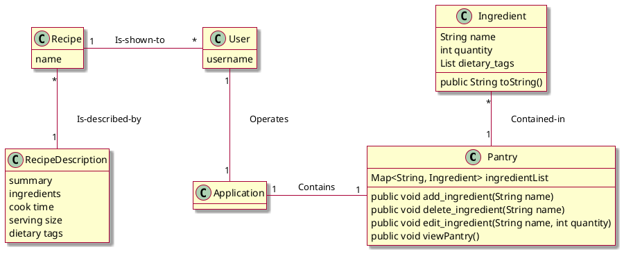

```plantuml
@startuml

skin rose

hide empty methods
' classes

class Pantry{
 Map<String, Ingredient> ingredientList
 --
 public void add_ingredient(String name)
 public void delete_ingredient(String name)
 public void edit_ingredient(String name, int quantity)
 public void viewPantry()
}

class Recipe{
 name
}

class RecipeDescription{
 summary
 ingredients
 cook time
 serving size
 dietary tags
}

class Ingredient{
 String name
 int quantity
 List dietary_tags
 __
 public String toString()
}


class Application{

}

class User{
 username
}


' associations
 User "1" -down- "1" Application : \tOperates\t\t
Application "1" -right- "1" Pantry : \tContains\t\t
Pantry "1" -up- "*" Ingredient : \tContained-in\t\t
Recipe "*" -down- "1" RecipeDescription : \tIs-described-by\t\t
User "*" -left- "1" Recipe : \tIs-shown-to\t\t


@enduml
```