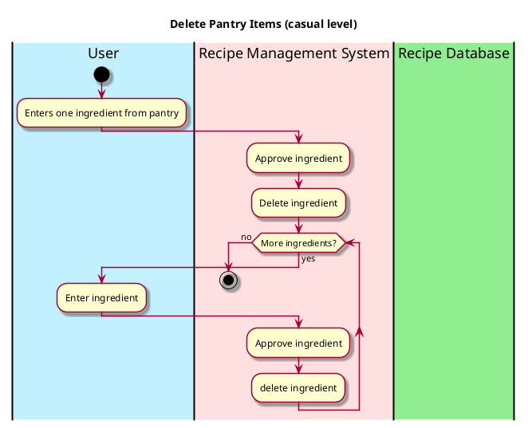

# Delete Pantry Items

## 1. Primary actor and goals
* __User__: want to delete ingredients their pantry.
* __Recipe Management System__: wants to understand each ingredient.

## 2. Other stakeholders and their goals

* * __User__: Want the recipe system to delete the right ingredients efficiently.

## 3. Preconditions

* The user identifies and chooses the items in the pantry.
* The system is ready to process and understand the ingredients.

## 4. Postconditions

* Ingredients are successfully deleted from the user's online pantry.

## 4. Workflow

Casual workflow for _upload ingredients_:

