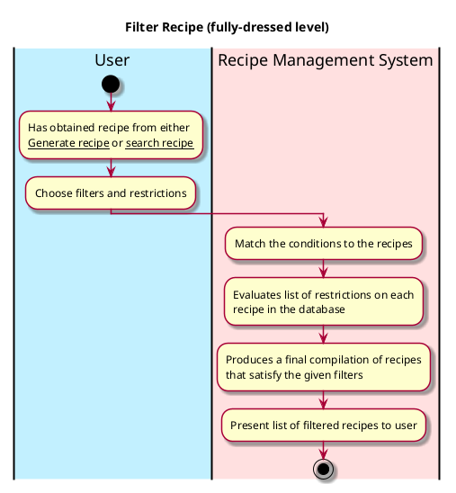

# Filter Recipe

## 1. Primary actor and goals
* __User__: wants to receive accurate and appealing recipe that aligns with their specifications like allergies.
* __Recipe Database__: should be holding a comprehensive list of recipes.
* __Recipe Management System__:  filters through the recipe database based on the tags and restrictions from users presents fitting ones to the user.


## 2. Other stakeholders and their goals

* __User__: Wants the recipe system and database to interact efficiently so that they get their recipe suggestions in a timely manner.


## 3. Preconditions
* The user has a recipe to filter
* The recipe management system has understood, processed, and stored all the filters.
* The recipe database can pull the recipes stored in the database.

## 4. Postconditions

* filters and restrictions are identified and matched to all recipes in the database.
* The recipe management system has filtered the recipes based on additional filters supplied by user.


## 5. Workflow

Fully-dressed workflow for _filter recipe_:


## 6. Sequence Diagram

```plantuml
@startuml
skin rose

hide footbox

actor User as user
participant ": UI" as ui
participant ": Controller" as cont
participant ": RecipeList" as rec

cont-> ui : displayRecipes()
ui -> user : Present list of recipes
ui -> user : Show filtering options
user -> ui : Select filtering tags (i.e. sweet/savory, vegan, etc.)
ui -> cont : recipeList.filter(tags)
cont -> rec : recipeList.filter(tags)

cont -> rec : getRecipeList()
loop i in 0..recipeList.size-1
cont -> rec : recipe = recipeList.filter(tags)
end

rec -> cont : recipeList.list()
cont -> ui : displayRecipes()
ui -> user : Present list of recipes


@enduml
````


