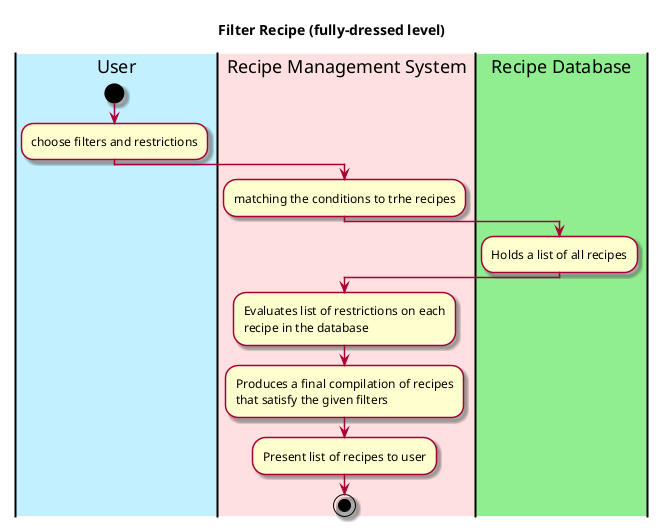

# Filter Recipe

## 1. Primary actor and goals
* __User__: wants to receive accurate and appealing recipe that aligns with their specifications like allergies.
* __Recipe Database__: should be holding a comprehensive list of recipes.
* __Recipe Management System__:  filters through the recipe database based on the tags and restrictions from users presents fitting ones to the user.

## 2. Other stakeholders and their goals

* __User__: Wants the recipe system and database to interact efficiently so that they get their recipe suggestions in a timely manner.

## 3. Preconditions

* The recipe management system has understood, processed, and stored all the filters.
* The recipe database can pull the recipes stored in the database.

## 4. Postconditions

* filters and restrictions are identified and matched to all recipes in the database.
* The recipe management system has filtered the recipes based on additional filters supplied by user.

## 4. Workflow

Fully-dressed workflow for _filter recipe_:

