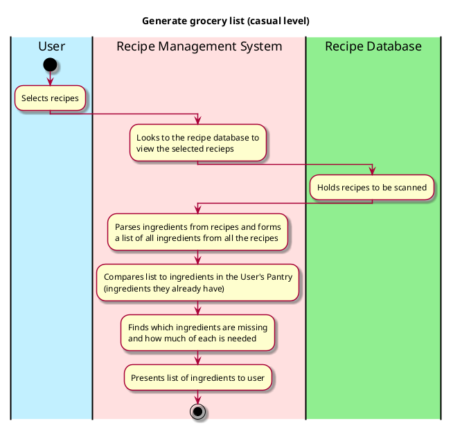

# Generate Grocery List

## 1. Primary actor and goals
* __User__: should be able to select recipes they want to make in a week and recieve information about ingredients they still need in order to make those dishes..
* __Recipe Management System__: parses ingredients from recipes the user has selected and compares them to a list of ingredients the user already has in their pantry.

## 2. Other stakeholders and their goals

* __Recipe Database__: should be holding a comprehensive list of recipes that the user can select from.

## 3. Preconditions

* The recipe system understands every ingredient in every recipe in the Recipe Database.
* The recipe system can compare a list of ingredients in recipes selected against ingredients owned (with quantities considered).

## 4. Postconditions

* The recipe management system has provided a list of ingredients to the user the recipes based on additional filters supplied by user.

## 4. Workflow

Fully-dressed workflow for _generate_grocery_list_:

