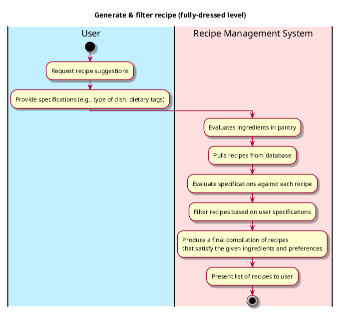
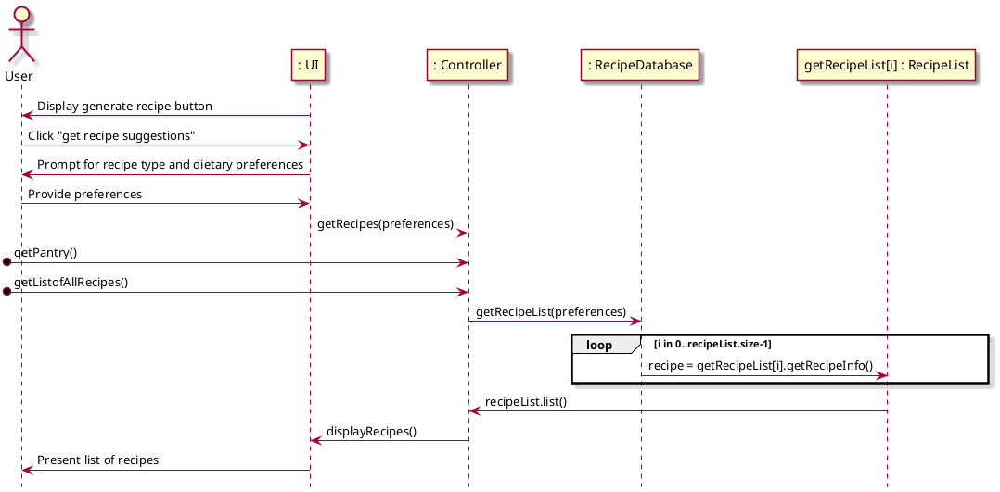

# Generate Recipe Suggestions

## 1. Primary actor and goals
* __User__: wants to receive accurate and appealing recipe suggestions that align with their specifications (e.g., type of dish, dietary preferences) and the ingredients available.
* __Recipe Management System__:  filters through the recipe database based on the ingredients stored and user specifications, presenting fitting recipes to the user.

## 2. Other stakeholders and their goals

* __User__: wants the recipe system and database to interact efficiently to receive timely and relevant recipe suggestions based on their input.

## 3. Preconditions

* The recipe management system has understood, processed, and stored all the uploaded ingredients.
* The recipe database can pull the ingredients stored in the management system and identify the ingredients in all the recipes in the database.

## 4. Postconditions

* Ingredients are identified and matched to all recipes in the database.
* The recipe management system has filtered recipes based on additional filters supplied by the user (e.g., recipe type, dietary preferences).

## 5. Workflow

Fully-dressed workflow for _generate_recipe_:

## 6. Sequence Diagram

