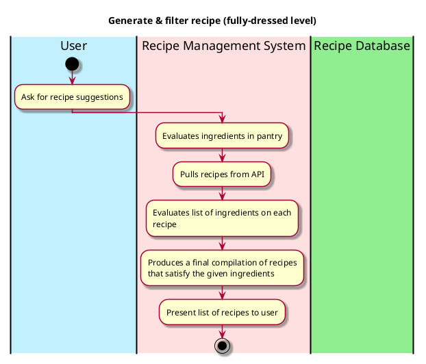

# Generate Recipe Suggestions

## 1. Primary actor and goals
* __User__: wants to receive accurate and appealing recipe suggestions that aligns with their specifications and ingredients.
* __Recipe Database__: should be holding a comprehensive list of recipes.
* __Recipe Management System__:  filters through the recipe database based on the ingredients the system has stored and presents fitting ones to the user.


## 2. Other stakeholders and their goals

* __User__: Wants the recipe system and database to interact efficiently so that they get their recipe suggestions in a timely manner.


## 3. Preconditions

* The recipe management system has understood, processed, and stored all the uploaded ingredients.
* The recipe database can pull the ingredients stored in the management system and identify the ingredients in all the recipes in the database.

## 4. Postconditions

* Ingredients are identified and matched to all recipes in the database.
* The recipe management system has filtered the recipes based on additional filters supplied by user. 


## 5. Workflow

Fully-dressed workflow for _generate_recipe_:


## 6. Sequence Diagram

```plantuml
@startuml
skin rose

hide footbox

actor User as user
participant ": UI" as ui
participant ": Controller" as cont
participant ": RecipeDatabase" as recd

ui -> user : Display generate recipe button
user -> ui : Click "get recipe suggestions"
ui -> cont : getRecipes()
[o-> cont : getPantry()

participant "getRecipeList[i] : RecipeList" as rec
cont -> recd : getRecipeList()
loop i in 0..recipeList.size-1
recd -> rec : recipe = getRecipeInfo()
end

rec -> cont : recipeList.list()
cont -> ui : displayRecipes()
ui -> user : Present list of recipes

@enduml
````

