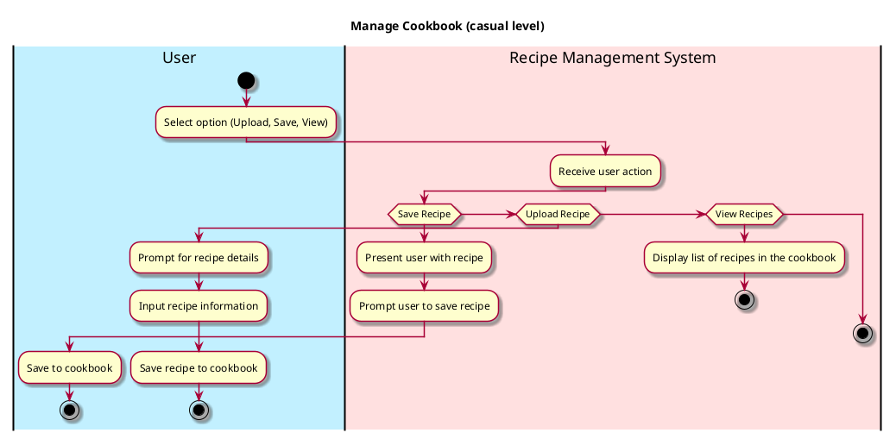

# Manage Cookbook

## 1. Primary actor and goals
* __User__: wants to create, edit, delete, and view recipes in their cookbook.
* __Recipe Management System__: provides functionalities for users to manage their recipes effectively, including adding new recipes, editing existing ones, and deleting recipes they no longer need.

## 2. Other stakeholders and their goals

* __Developer__: Ensures that the Recipe Management System runs smoothly and that user data is secure and properly maintained.

## 3. Preconditions

* The user should have an existing cookbook or the ability to create one.
* The system has access to recipes.

## 4. Postconditions

* The user successfully adds, edits, or deletes recipes from their cookbook.
* The updated list of recipes is displayed to the user after any modifications.

## 5. Workflow

Casual workflow for _manage_cookbook_:

