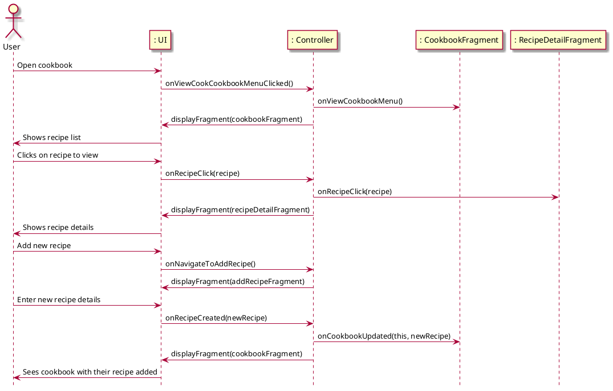

# Manage Cookbook

## 1. Primary actor and goals
* __User__: wants to save recipes to cookbook and view recipes in their cookbook.
* __Recipe Management System__: provides functionalities for users to manage their recipes effectively, including saving new recipe and viewing full list.

## 2. Other stakeholders and their goals

* __Developer__: Ensures that the Recipe Management System runs smoothly and that user data is secure and properly maintained.

## 3. Preconditions

* The user should have an existing cookbook or the ability to create one.
* The system has access to recipes.

## 4. Postconditions

* The user successfully adds recipes to their cookbook and can view all of them.
* The updated list of recipes is displayed to the user after any modifications.

## 5. Workflow

Fully-dressed workflow for _manage_cookbook_:

## 6. Sequence Diagram

