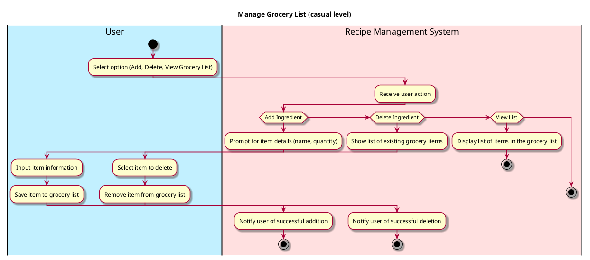

# Manage Grocery List

## 1. Primary actor and goals
* __User__: wants to create, edit, delete, and view items on their grocery list.
* __Recipe Management System__: allows users to manage their grocery list efficiently, including adding items they need to buy, marking items as purchased, and removing items from the list.

## 2. Other stakeholders and their goals

* __Developer__: Ensures the Recipe Management System is functional and that user data is secure.

## 3. Preconditions

* User should have an existing grocery list or the ability to create a new one.

## 4. Postconditions

* User successfully adds, edits, or deletes items from their grocery list.
* The updated grocery list is displayed to the user after any modifications.

## 5. Workflow

Casual workflow for _manage_grocery_list_:

