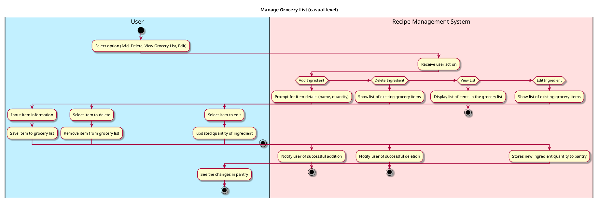

# Manage Grocery List

## 1. Primary actor and goals
* __User__: wants to create, edit, delete, and view items on their grocery list.
* __Recipe Management System__: allows users to manage their grocery list efficiently, including adding items they need to buy, marking items as purchased, and removing items from the list.


## 2. Other stakeholders and their goals

* __Developer__: Ensures the Recipe Management System is functional and that user data is secure.


## 3. Preconditions

* User should have an existing grocery list or the ability to create a new one.


## 4. Postconditions

* User successfully adds, edits, or deletes items from their grocery list.
* The updated grocery list is displayed to the user after any modifications.


## 5. Workflow

Casual workflow for _manage_grocery_list_:




## 6. Sequence Diagram


```plantuml
```plantuml
@startuml
skin rose

hide footbox

actor User as user
participant ": UI" as ui
participant ": Controller"  as cont
participant ": curGroceryList : GroceryList" as grocery
participant ": Ingredient" as ingr

ui -> user : Display add ingredient option
user -> ui : Input ingredient name
user -> ui : Input ingredient quantity
user -> ui : Input ingredient unit
user -> ui : Input dietary tags
ui -> cont : addIngredient(name, quantity, unit, tags)
cont -> grocery : add_ingredient(name, quantity, unit, tags)
grocery -> ingr **: ingr = create(name,quantity,unit,tags)
grocery -> cont : curGroceryList.display()
cont -> ui : updateDisplay(grocery)
ui -> user : Show updated Grocery list

@enduml
````

```plantuml
@startuml
skin rose

hide footbox

actor User as user
participant ": UI" as ui
participant ": Controller"  as cont
participant ": curGroceryList : GroceryList" as grocery

ui -> user : Display delete ingredient option
user -> ui : Input ingredient name to delete
ui -> cont : deleteIngredient(name)
cont -> grocery : delete_ingredient(name)
grocery -> cont : curGroceryList.list()
cont -> ui : updateDisplay(grocery)
ui -> user : Show updated Grocery list

@enduml
````

```plantuml
@startuml
skin rose

hide footbox

actor User as user
participant ": UI" as ui
participant ": Controller"  as cont
participant ": curGroceryList : GroceryList" as grocery

ui -> user : Display edit buttons
user -> ui : Select existing ingredient name
user -> ui : Click edit button to change quantity
ui -> cont : editItem(name, quantity)
cont -> grocery : editItem(name, quantity)
grocery -> cont : curGrocery.ingredient()
cont -> ui : updateDisplay(grocery)
ui -> user : show updated ingredient information

@enduml


```plantuml
@startuml
skin rose

hide footbox

actor User as user
participant ": UI" as ui
participant ": Controller"  as cont
participant ": curGroceryList : GroceryList" as grocery

ui -> user : Display view Grocery List buttons
user -> ui : Click view Grocery List buttons to view the full Grocery List
ui -> cont : viewGroceryList()
cont -> grocery :  viewGroceryList()
pantry -> grocery :  viewGroceryList()
cont -> ui : Display(grocery)
ui -> user : show full Grocery List

@enduml

````