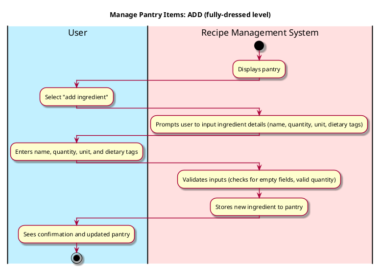
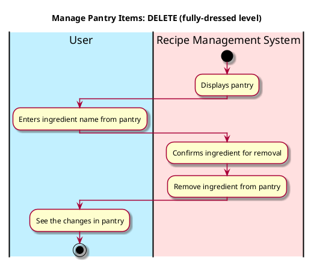
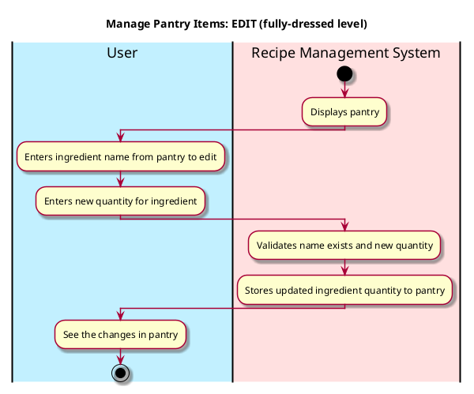

# Manage Pantry Items

## 1. Primary actor and goals
* __User__: want to manage ingredients their pantry, including action of upload and delete.
* __Recipe Management System__: wants to process the action that user takes and change the database accordingly.


## 2. Other stakeholders and their goals

* __User__: Want the recipe system to delete or upload the right ingredients efficiently.


## 3. Preconditions

* The user get into the pantry, either upload or delete the items.
* The system is ready to process and understand the ingredients.

## 4. Postconditions

* Ingredients are successfully deleted from or uploaded to the user's online pantry.


## 5. Workflow

Workflow for _manage_pantry_items_:







## 6. Sequence Diagram

```plantuml
@startuml
skin rose

hide footbox

actor User as user
participant ": UI" as ui
participant ": Controller" as cont

ui -> user : Display add ingredient option
ui -> cont : onAddIngredientButtonClicked()
cont -> ui: displayFragment(addIngredientFragment)
user -> ui : Input ingredient name
user -> ui : Input ingredient quantity
user -> ui : Input ingredient unit
user -> ui : Select dietary tags
ui -> cont : onAddIngredient(name, qty, unit, tags)
cont -> PantryFragment : addIngredient(newIngredient)
PantryFragment -> cont : updatePantryDisplay()
cont -> ui : onItemsDone()
ui -> user : Show updated pantry display

@enduml

````

```plantuml
@startuml
skin rose

hide footbox

actor User as user
participant ": UI" as ui
participant ": Controller" as cont

ui -> user : Display delete ingredient icons
user -> ui : Click delete icon on ingredient card
ui -> cont : onDeleteIngredient(name)
cont -> PantryFragment : deleteIngredient(name)
PantryFragment -> cont : updatePantryDisplay()
cont -> ui : onDeletionDone()
ui -> user : Show updated pantry display

@enduml

````

```plantuml
@startuml
skin rose

hide footbox

actor User as user
participant ": UI" as ui
participant ": Controller" as cont
participant ": curPantry : Pantry" as pantry

ui -> user : Display edit ingredient icons
user -> ui : Click edit icon on ingredient card
user -> ui : Input new quantity
ui -> cont : onEditIngredient(name, newQuantity)
cont -> pantry : editIngredient(name, newQuantity)
pantry -> cont : updatePantryDisplay()
cont -> ui : onEditDone()
ui -> user : Show updated pantry display

@enduml

````