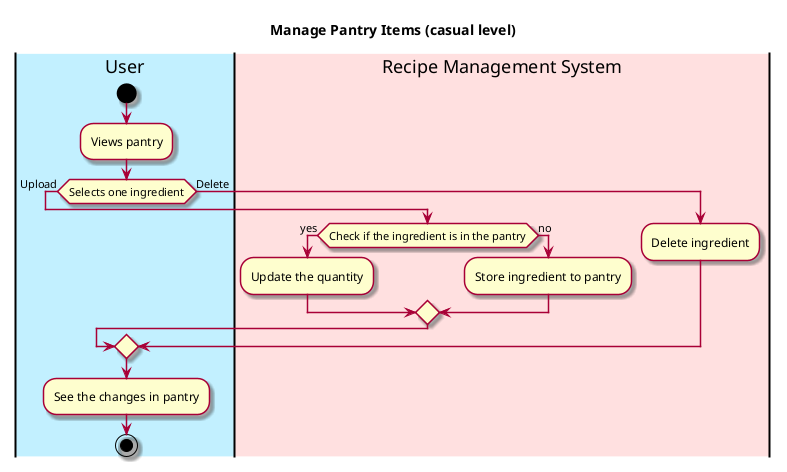

# Manage Pantry Items

## 1. Primary actor and goals
* __User__: want to manage ingredients their pantry, including action of upload and delete.
* __Recipe Management System__: wants to process the action that user takes and change the database accordingly.


## 2. Other stakeholders and their goals

* __User__: Want the recipe system to delete or upload the right ingredients efficiently.


## 3. Preconditions

* The user get into the pantry, either upload or delete the items.
* The system is ready to process and understand the ingredients.

## 4. Postconditions

* Ingredients are successfully deleted from or uploaded to the user's online pantry.


## 5. Workflow

Casual workflow for _manage_pantry_items_:



## 6. Sequence Diagram

```plantuml
@startuml
skin rose

hide footbox

actor User as user
participant ": UI" as ui
participant ": Controller"  as cont
participant ": curPantry : Pantry" as pantry
participant ": Ingredient" as ingr

ui -> user : Display add/delete buttons
user -> ui : Input ingredient name and quantity
user -> ui : Click "add ingredient"
ui -> cont : addItem(name, quantity)
cont -> pantry : addItem(name, quantity)
pantry -> ingr **: ingr = create(name, quantity)
pantry -> ui : curPantry.list()
cont -> ui : updateDisplay(pantry)
ui -> user : show current pantry list

@enduml
````

```plantuml
@startuml
skin rose

hide footbox

actor User as user
participant ": UI" as ui
participant ": Controller"  as cont
participant ": curPantry : Pantry" as pantry

ui -> user : Display add/delete buttons
user -> ui : Input ingredient name and quantity
user -> ui : Click "delete ingredient"
ui -> cont : deleteItem(name, quantity)
cont -> pantry : deleteItem(name, quantity)
pantry -> ui : curPantry.list()
cont -> ui : updateDisplay(pantry)
ui -> user : show current pantry list

@enduml
````