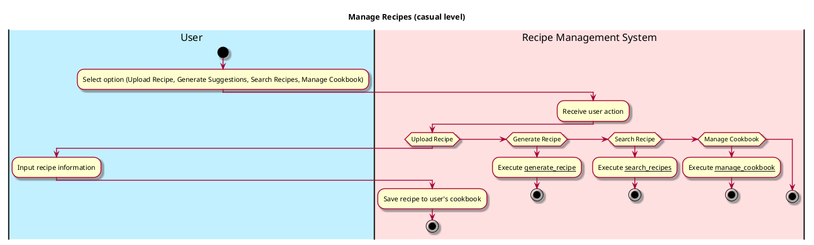

# Manage Recipes

## 1. Primary actor and goals
* __User__: wants to upload their own recipes, generate recipe suggestions based on ingredients in their pantry, search for existing recipes, and manage the list of recipes.
* __Recipe Management System__: allows users to efficiently handle their recipes, make suggestions based on available ingredients, and manage their cookbook.


## 2. Other stakeholders and their goals

* __Developer__: Ensures the Recipe Management System functions correctly and maintains user data security.


## 3. Preconditions

* The user should have a pantry with ingredients listed to generate recipe suggestions.
* The user should have the ability to add recipes to their personal cookbook.

## 4. Postconditions

* The user successfully uploads a new recipe to the system.
* Recipe suggestions are generated based on the ingredients available in the user's pantry.
* The user can search for existing recipes and manage their personal cookbook.


## 5. Workflow

Casual workflow for _manage_recipes_:



## 6. Sequence Diagram

```plantuml
@startuml
skin rose

hide footbox

actor User as user
participant ": UI" as ui
participant ": Controller"  as cont
participant ": Cookbook" as cb
participant ": Recipe" as rec


user -> ui : Selects "View Cookbook"
ui -> cont : viewCookbook()
cont -> cb : Retrieve all recipes
cb --> cont : Return list of recipes
cont --> ui : Display list of recipes

user -> ui : Selects "Upload Recipe"
ui -> cont : uploadRecipe(name, description, cookTime, servingSize, ingredients, instructions)
cont -> cb : Add new recipe to database
cb -> rec **: rec = create(name,quantity,unit,tags)
cb --> cont : Confirmation
cont --> ui : "Recipe uploaded successfully"

user -> ui : Selects "Search Recipe by Name"
ui -> cont : searchRecipeByName(name)
cont -> cb : Search recipes by name
cb --> cont : Return matched recipes
cont --> ui : Display matched recipes

user -> ui : Selects "Generate Recipe Suggestions"
ui -> cont : generateRecipeSuggestions()
cont -> genRecipe : Instantiate Generate_Recipe(pantry, allRecipes)
genRecipe -> cb : Fetch recipes and pantry items
genRecipe --> cont : Return suggested recipes
cont --> ui : Display suggested recipes


@enduml
````