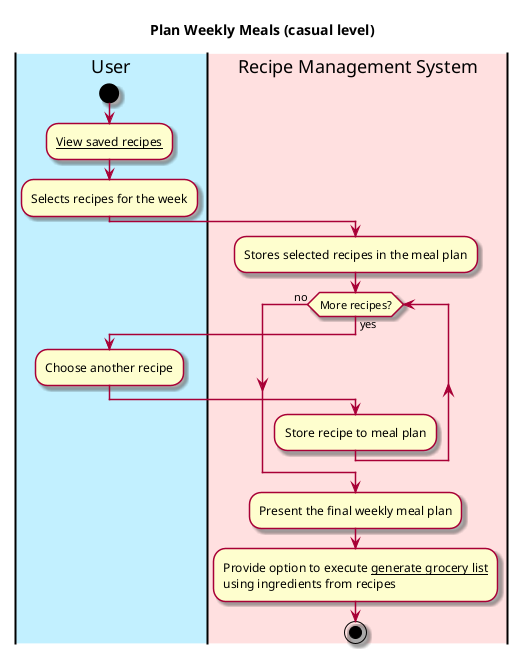

# Plan Weekly Meals

## 1. Primary actor and goals
* __User__: wants to plan their weekly meals by selecting and organizing recipes from a saved list.
* __Recipe Management System__: wants to process the user's selections, pull recipes, and create an accessible list


## 2. Other stakeholders and their goals

* __User__: want the list to be clear and formed efficiently


## 3. Preconditions

* The user has access to a list of saved recipes.
* The system is ready to process and understand the user's selections.

## 4. Postconditions

* The Recipe Management System processes the selected recipes and displays a structured weekly meal plan to the user.


## 5. Workflow

Casual workflow for _plan weekly meals_:




## 6. Sequence Diagram

```plantuml
@startuml
skin rose

hide footbox

actor User as user
participant ": UI" as ui
participant ": Controller"  as cont
participant ": Cookbook" as cb
participant ": Weekly Meals" as wm


user -> ui : Selects "plan weekly meals"
ui -> cont : viewCookbook()
cont -> cb : Retrieve all recipes
cb --> cont : Return list of recipes
cont --> ui : Display list of recipes

user -> ui : Selects Recipe 
ui -> cont : saveRecipeToPlan(name, description, cookTime, servingSize, ingredients, instructions)
cont -> wm : Add new recipe to Weekly Meals
cont --> ui : updateDisplay(wm)
ui --> user : present new Weekly Plan

@enduml
````


