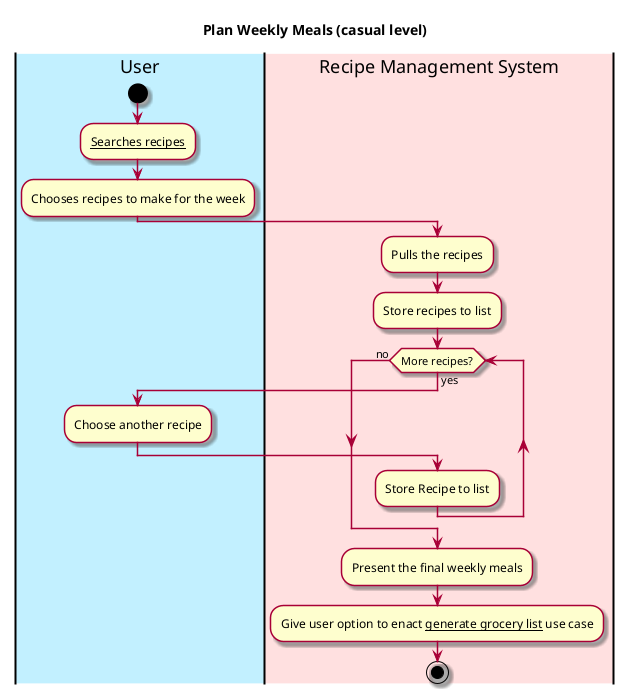

# Plan Weekly Meals

## 1. Primary actor and goals
* __User__: want to plan their weekly meals by adding recipes they can make to list.
* __Recipe Management System__: wants to understand the recipes and pull from the Recipe Database.

## 2. Other stakeholders and their goals

* __User__: want the list to be clear and formed efficiently

## 3. Preconditions

* The user choose recipes.
* The system is ready to process and understand the recipes and form the list.

## 4. Postconditions

* Recipe System processes the list and show it to the user.

## 5. Workflow

Casual workflow for _plan weekly meals_:

