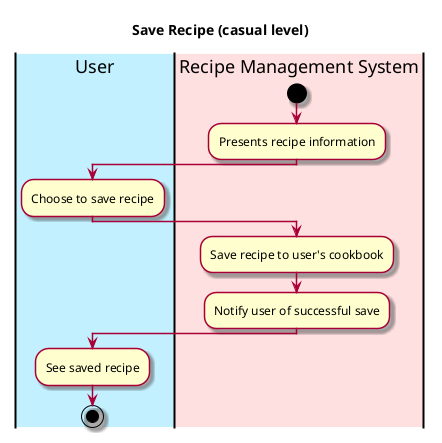

# Save Recipe
### _Not relevant as of final submission_


## 1. Primary actor and goals
* __User__: wants to save a recipe in the Recipe Management System for future reference.
* __Recipe Management System__: stores recipes, ensuring they are easily retrievable and well-organized.


## 2. Other stakeholders and their goals

* __Developer__:  Ensures the system is secure, reliable, and that recipe data is properly managed.


## 3. Preconditions

* A recipe must be already formed (either by user or from database)

## 4. Postconditions

* The recipe is saved in the user's cookbook within the Recipe Management System.

## 5. Workflow

Casual workflow for _save_recipe_:




## 6. Sequence Diagram

```plantuml
@startuml
skin rose

hide footbox

actor User as user
participant ": UI" as ui
participant ": Controller"  as cont
participant ": Cookbook" as cb

user -> ui : Selects "Save Recipe"
ui -> cont : saveRecipe(name, description, cookTime, servingSize, ingredients, instructions)
cont -> cb : addRecipe(name, description, cookTime, servingSize, ingredients, instructions)
cont --> ui : updateDisplay(cb)
ui --> user: "Recipe uploaded successfully"

@enduml
````
