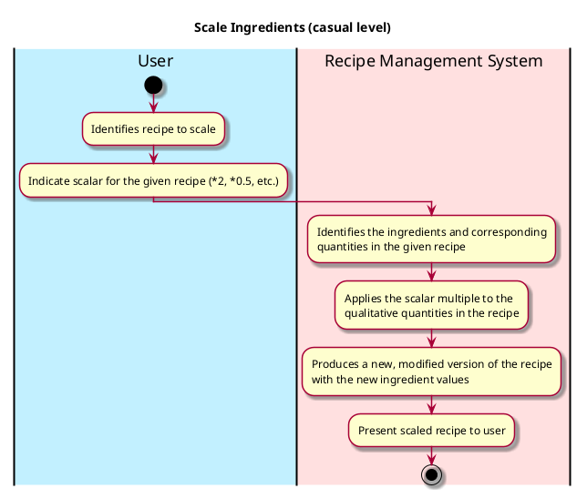
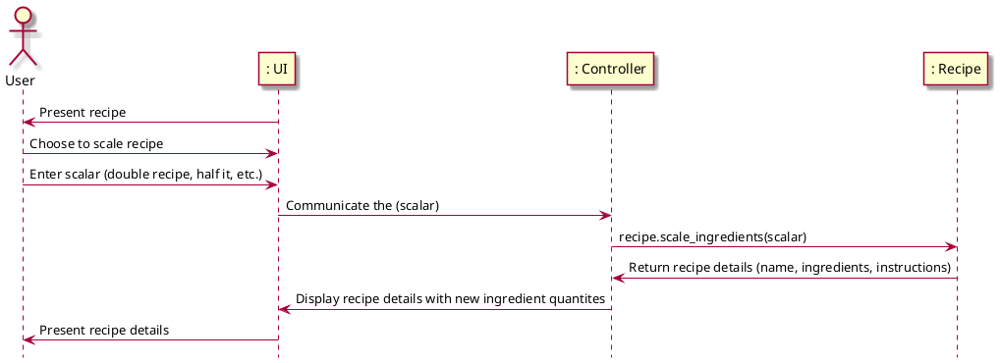

# Scale Ingredients

## 1. Primary actor and goals
* __User__: wants to easily get clear information on the amount of ingredients they'll need without doing calculation.
* __Recipe Management System__: wants to calculate ingredient amounts and scale them comprehensively, with ease, and without error.

## 2. Other stakeholders and their goals

* __Recipe Database__: Doesn't want original recipe files to be corrupted or altered.

## 3. Preconditions

* The recipe management system can understand and process the given quantity for each ingredient.
* The user has indicated how they want to scale the recipe (doubled, halved, etc.).

## 4. Postconditions

* Ingredients are identified and matched to all recipes in the database.
* The recipe management system has filtered the recipes based on additional filters supplied by user.

## 5. Workflow

Casual workflow for _scale ingredients_:

## 6. Sequence Diagram

