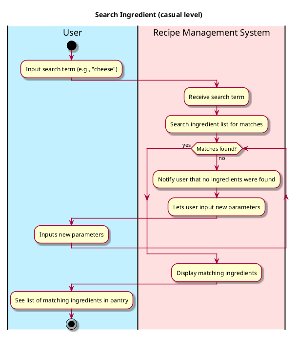
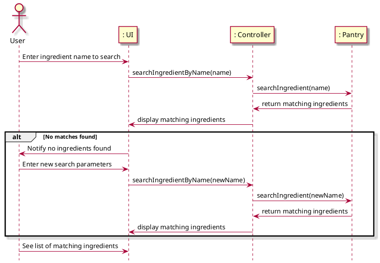

# Search Ingredient

## 1. Primary actor and goals
* __User__: wants to find specific ingredients from pantry to use in recipes or for inventory purposes.
* __Recipe Management System__: provides functionality to search and retrieve ingredients stored in the pantry based on user input.

## 2. Other stakeholders and their goals

* __Developer__: Ensure the Recipe Management System is functioning properly and that the ingredient database is updated and maintained.

## 3. Preconditions

* The pantry must contain valid ingredients stored in the system.
* The user must have access to pantry.

## 4. Postconditions

* The system provides the user with a list of ingredients matching the search criteria.
* If no ingredients match the search criteria, the system notifies the user that no results were found.

## 5. Workflow

Casual workflow for _search_ingredient_:

## 6. Sequence Diagram

