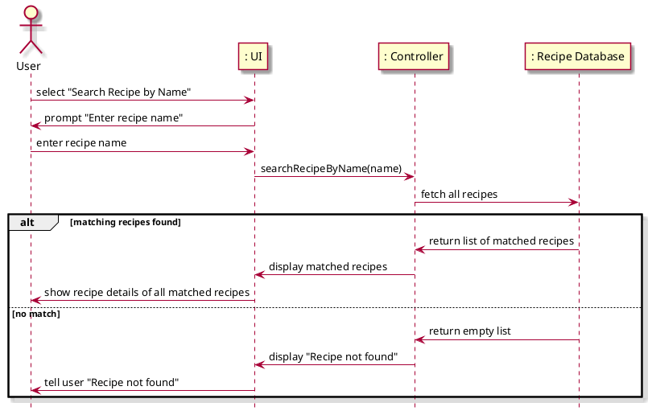

# Search Recipes

## 1. Primary actor and goals
* __User__: wants to search accurate recipe that aligns with their specifications.
* __Recipe Management System__:  Should be holding a comprehensive list of recipes. Filters through the recipe database based on the recipes that the Recipe Database has stored and presents fitting ones to the user.

## 2. Other stakeholders and their goals

* __User__: Wants the recipe system and database to interact efficiently so that they get their recipe suggestions in a timely manner.

## 3. Preconditions

* The recipe system has understood, processed the recipe
* The recipe database can pull the recipes stored in the database.

## 4. Postconditions

* The recipe management system has filtered the recipes based on additional filters supplied by user.

## 5. Workflow

Fully-dressed workflow for _search recipe_:

## 6. Sequence Diagram

