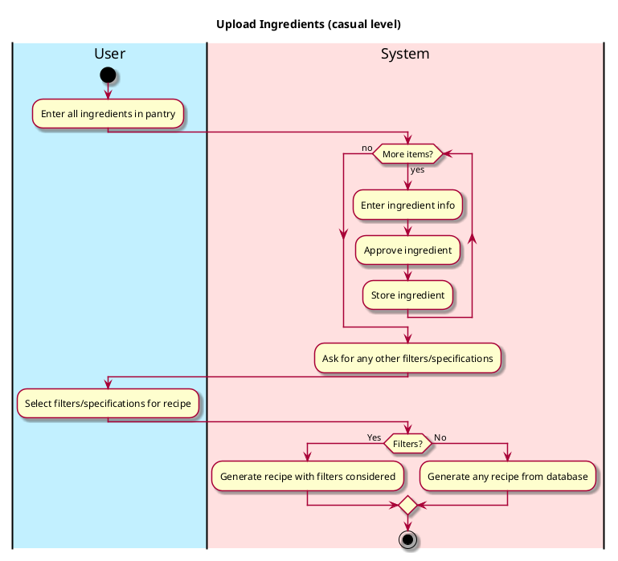

# Upload Ingredients

## 1. Primary actor and goals
__User__: wants to upload all the ingredients in their pantry to find out what recipes they can make with them.

## 2. Other stakeholders and their goals

* __System__: Wants to save the ingredients into the database for easy access and analysis.

## 3. Preconditions

* The user has successfully uploaded all the ingredients to they system and specified any other filters/specifications.

## 4. Postconditions

* Ingredients are saved into their online pantry.

## 4. Workflow

Casual workflow for _uploading ingredients_:

