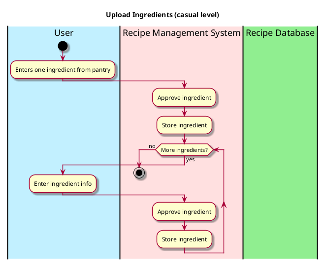

# Upload Ingredients

## 1. Primary actor and goals
* __User__: wants to upload all the ingredients in their pantry to find out what recipes they can make with them.
* __Recipe Management System__: wants to understand each ingredient uploaded and store it to be accessed by the Recipe Database.

## 2. Other stakeholders and their goals

* __Recipe Database__: Wants to understand and process the ingredients so that it can identify those ingredients in other recipes.

## 3. Preconditions

* The user identifies the items in their pantry.
* The system is ready to process and understand the ingredients.

## 4. Postconditions

* Ingredients are successfully saved into the user's online pantry.

## 4. Workflow

Casual workflow for _upload ingredients_:

