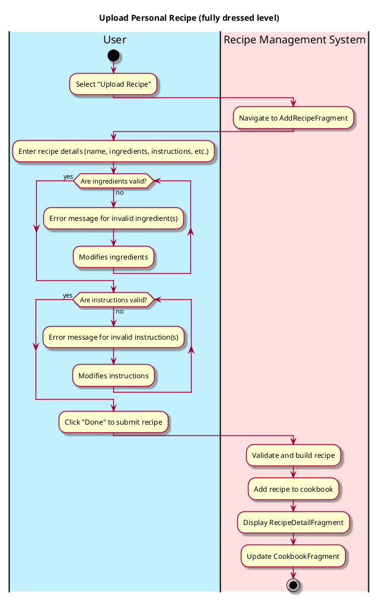
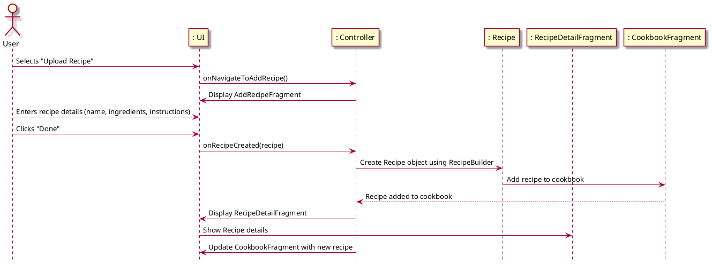

# Upload Personal Recipe

## 1. Primary actor and goals
* __User__: wants to upload a complete personal recipe, including ingredients and preparation steps.
* __Recipe Management System__: wants to understand each ingredient in the new uploaded recipe and store both the new ingredients and recipe for access by the Recipe Database.

## 2. Other stakeholders and their goals

* __Recipe Database__: wants to understand and process the newly uploaded recipe for future retrieval and display.

## 3. Preconditions

* The user identifies the personal recipe.
* The system is ready to process and understand the personal recipe.

## 4. Postconditions

* Recipe is successfully saved into a Recipe Database.

## 5. Workflow

Casual workflow for _upload personal recipe_:

## 6. Sequence Diagram

