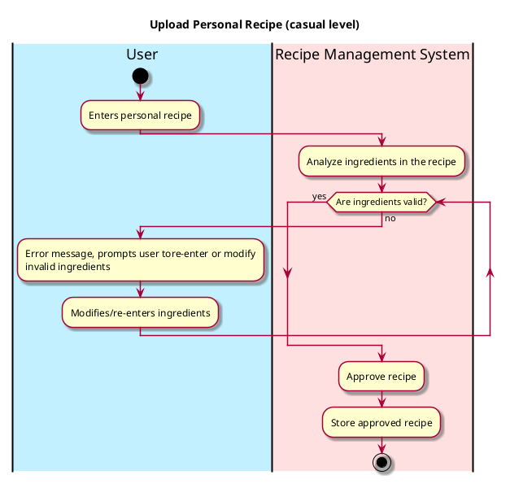

# Upload Personal Recipe

## 1. Primary actor and goals
* __User__: wants to upload all the new personal recipe.
* __Recipe Management System__: wants to understand each ingredient in the new uploaded recipe and store new ingredients and recipe to be accessed by the Recipe Database.

## 2. Other stakeholders and their goals

* __Recipe Database__: Wants to understand and process the recipe.

## 3. Preconditions

* The user identifies the personal recipe.
* The system is ready to process and understand the personal recipe.

## 4. Postconditions

* Recipe is successfully saved into the Recipe Database.

## 4. Workflow

Casual workflow for _upload personal recipe_:

