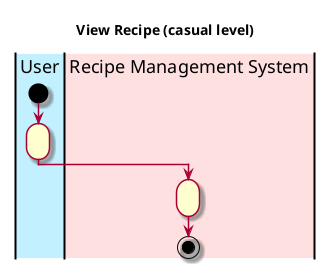

# View Recipe

## 1. Primary actor and goals
* __User__:
* __Recipe Management System__:

## 2. Other stakeholders and their goals

* __User__:

## 3. Preconditions

*
*

## 4. Postconditions

*
*

## 5. Workflow

Casual workflow for _view_recipe_:

