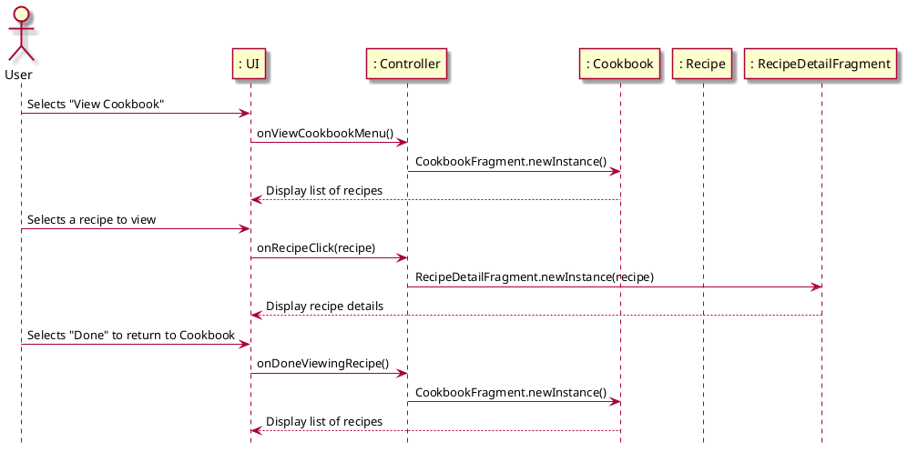

# View Recipe

## 1. Primary actor and goals
* __User__: wants to view the details of a specific recipe from search results in the Recipe Management System to decide whether to use or save it.
* __Recipe Management System__: retrieves and displays the details of a selected recipe based on the user's search.

## 2. Other stakeholders and their goals

* __Developer__: Ensures the system is secure and that recipe data is accurately retrieved and displayed.

## 3. Preconditions

* User must have performed a search that yields at least one recipe.

## 4. Postconditions

* User successfully views the details of the selected recipe from search results.
* User can decide whether to use the recipe or save it for future reference.

## 5. Workflow

Fully-dressed workflow for _view_recipe_:

## 6. Sequence Diagram

