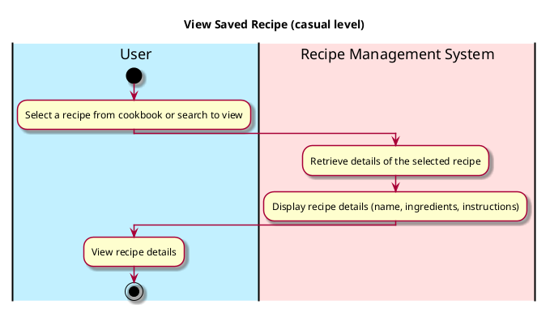

# View Saved Recipe

## 1. Primary actor and goals
* __User__: wants to view the details of a specific recipe from their saved recipes within the Recipe Management System.
* __Recipe Management System__: retrieves and displays the details of a selected recipe to the user.

## 2. Other stakeholders and their goals

* __Developer__: Ensures the system is secure and that recipe data is accurately retrieved and displayed.

## 3. Preconditions

* User must have at least one recipe saved in their cookbook.

## 4. Postconditions

* User successfully views the details of the selected recipe, including ingredients and instructions.

## 5. Workflow

Casual workflow for _view_saved_recipe_:

