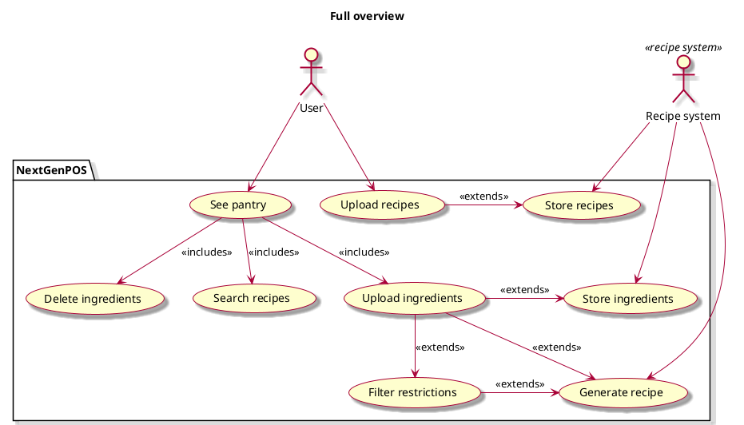

## Target Audience
Anyone who wants to streamline and simplify their cooking processes.
Specifically, college students, young adults, or people with food restrictions.

## Main Features
An intuitive meal-planning assistant app that suggests recipes based on available ingredients. Users can upload their pantry items, and the app generates recipes that can be filtered by ease, serving size, and dietary restrictions. Features include scaling ingredients to match serving sizes, uploading personal favorite recipes, weekly meal planning, and generating customized grocery lists based on selected meals. The app helps users efficiently plan meals while accommodating specific food restrictions.r people with food restrictions.

## Constraints

## Actors
* __System__: processes ingredients and generates recipes
* __User__: Uploads recipes, browses for recipes, submits their pantry items

