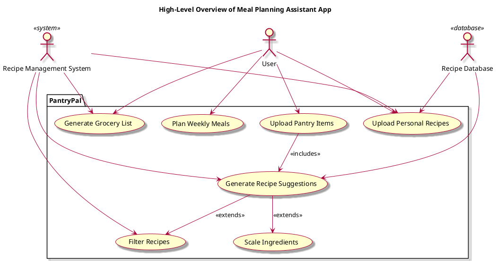

## Target Audience
Anyone who wants to streamline and simplify their cooking processes, specifically targeting:
* College students 
* Young adults 
* Individuals with food restrictions

## Main Features
An intuitive meal-planning assistant app that suggests recipes based on available ingredients. Users can upload their pantry items, and the app generates recipes that can be filtered by ease, serving size, and dietary restrictions. Key features include:

* __Recipe Suggestions__: Automatically generated recipes based on the user's pantry items. 
* __Filtering Options__: Recipes can be filtered by ease of preparation, serving size, and dietary restrictions. 
* __Ingredient Scaling__: Automatically adjust ingredient quantities based on desired serving sizes. 
* __Personal Recipe Upload__: Users can upload their favorite recipes for personalized suggestions. 
* __Weekly Meal Planning__: Tools for planning meals for the week to enhance organization and convenience. 
* __Grocery List Generation__: Customized grocery lists created based on selected recipes, helping users streamline their shopping process.

The app aims to help users efficiently plan meals while accommodating specific food restrictions.

## Constraints
* __User Interface__: The app must be user-friendly and intuitive, especially for users with varying levels of tech-savviness. 
* __Dietary Requirements__: The app must accurately filter and suggest recipes based on diverse dietary restrictions. 

## Actors
* __User__: Interacts with the app to upload pantry items, browse and filter recipes, and upload personal recipes. 
* __Recipe Management System__: Processes user inputs, generates recipe suggestions, and manages user interactions. 
* __Recipe Database__: Stores all available recipes, user-uploaded recipes, and manages retrieval for generating suggestions.

## Use Cases and Interactions

### Upload Pantry Items
- **Interaction**: The user uploads a list of ingredients they currently have in their pantry. This data is captured by the Recipe Management System.
- **Purpose**: To allow the system to generate personalized recipe suggestions based on the available ingredients.

### Generate Recipe Suggestions
- **Interaction**: Upon uploading pantry items, the system processes this information and generates a list of potential recipes that can be made with those ingredients.
- **Includes**:
    - **Upload Pantry Items**: This use case is included because it’s a prerequisite for generating suggestions.
- **Extends**:
    - **Filter Recipes**: Users can apply various filters (e.g., dietary restrictions, cooking time) to refine the suggestions.
    - **Scale Ingredients**: Users can choose to scale the suggested recipe ingredients based on the desired serving size.

### Filter Recipes
- **Interaction**: After the initial recipe suggestions are generated, the user can specify criteria (like dietary restrictions or cooking time) to filter the results. The Recipe Management System applies these filters to the list of suggested recipes.
- **Purpose**: To help users find recipes that meet their specific needs and preferences.

### Scale Ingredients
- **Interaction**: Users can adjust the ingredient quantities in the suggested recipes to match their desired number of servings. The Recipe Management System recalculates the amounts accordingly.
- **Purpose**: To ensure users can prepare the correct quantities based on their needs.

### Upload Personal Recipes
- **Interaction**: The user has the option to upload their own recipes into the system. The Recipe Management System saves these to the Recipe Database for future reference.
- **Purpose**: To personalize the recipe suggestions by including the user’s favorite recipes.

### Plan Weekly Meals
- **Interaction**: The user selects recipes for the week, which the Recipe Management System organizes into a meal plan. The chosen recipes are linked to the ingredients they contain.
- **Purpose**: To facilitate meal organization for the week, helping users stay prepared and reduce last-minute cooking decisions.

### Generate Grocery List
- **Interaction**: Once the user has selected recipes for their meal plan, the system compiles a grocery list based on the ingredients needed for those recipes. This list is generated by the Recipe Management System and can be displayed to the user for convenience.
- **Purpose**: To streamline the shopping process, ensuring users purchase all necessary ingredients for their planned meals.

## Actor Relationships

- The user is directly linked to several use cases (uploading pantry items, uploading personal recipes, planning meals, and generating grocery lists).
- The Recipe Management System is linked to various use cases, indicating that it is the central processor of actions related to recipe management and user interactions.
- The Recipe Database interacts with the Recipe Management System for both uploading personal recipes and generating recipe suggestions.
