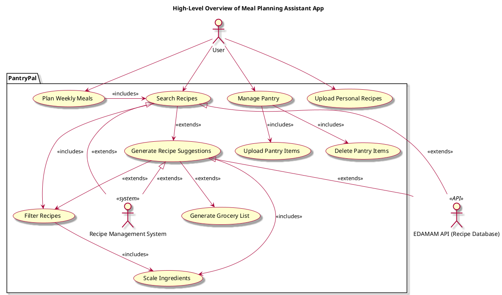

# Pantry Pal Cooking Assistant Application - Vision Document

## 1. Introduction

We envision an intuitive meal-planning assistant app that suggests recipes based on available ingredients. Users can upload their pantry items, and the app generates recipes that can be filtered by ease, serving size, and dietary restrictions. Key features include:

## 2. Business case
Our cooking assistant software addresses customer needs that other products do not:
1. It can provide users with personalized recipes based on the ingredients they have or dietary restrictions they specify.
2. It can help users take a visual inventory of what products they have to plan meals for the week.

## 3. Key functionality
- **Recipe Suggestions**: Automatically generated recipes based on the user's pantry items.
- **Filtering Options**: Recipes can be filtered by ease of preparation, serving size, and dietary restrictions.
- **Ingredient Scaling**: Automatically adjust ingredient quantities based on desired serving sizes.
- **Personal Recipe Upload**: Users can upload their favorite recipes for personalized suggestions.
- **Weekly Meal Planning**: Tools for planning meals for the week to enhance organization and convenience.
- **Grocery List Generation**: Customized grocery lists created based on selected recipes, helping users streamline their shopping process.

## 4. Stakeholder goals summary
- **User**: manage pantry, upload personal recipes, specify filters, search recipes

## Use case diagram

